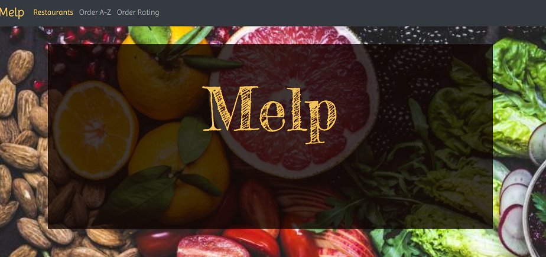
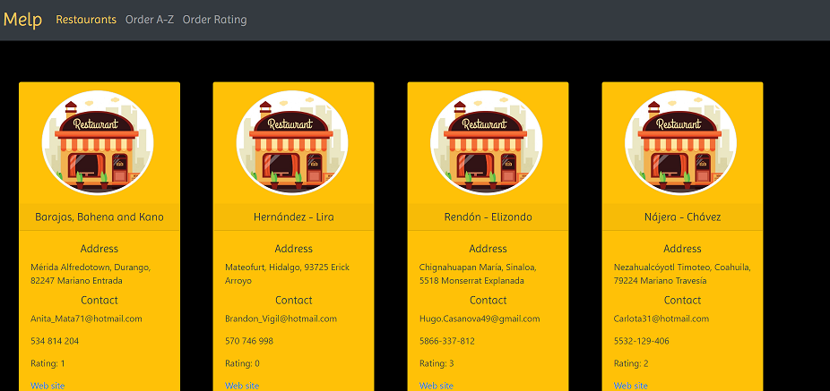
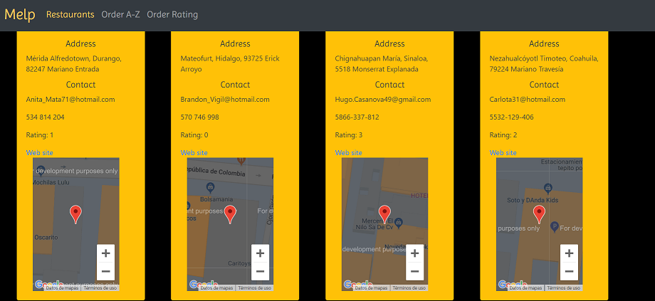

# Intelimetrica

## Comenzando
Melp es una empresa enfocada en mostrar información de los restaurantes de la ciudad. Ya cuentan con una aplicación movil muy famosa y quiere expandir su negocio haciendo una plataforma web que muestre la información de los restaurantes.

## Requisitos del proyecto 
Una interfaz web hermosa y organizada donde muestre los datos de los restaurantes, que los restaurantes se puedan ordenar por Rating o por orden alfábetico.

## Historias de usuario
En este  proyecto trabaje con las siguientes historias de usuario:
* Yo como usuario quiero ver los restaurantes disponibles.
* Yo como usuario quiero tener la información de contacto de los restaurantes
* Yo como susuario quiero saber la dirección de los restaurantes.
* Yo como usuario quiero visualizar la posicion de los restaurantes (Google Maps).

En este proyecto trabaje con estas historias de usuario y las complete.

## Construido con

* Angular 8
* Bootstrap 
* Angular-maps para implementar Google Maps y mostrar la ubicación de cada restaurante.

## Planeación

Se implementa Github Proyects para hacer el tablero kanban con las historias de usuario que se trabajaron para este proyecto.

## Propuesta de Diseño 
Una barra de navegación fija para que el usuario pueda acceder a cada una de las secciones en cualquier momento. 
Se ponen los restaurantes en la página principal donde se muestra la siguiente información:
* Nombre del Restaurant.
* Dirección.
* Información de contacto (email y teléfono).
* Número de Rating
* Sitio web
* Mapa donde se muestra la ubicación del Restaurante.

Es single page aplication lo que lo hace más rápida, ya que en lugar de cargar toda la página solo carga la parte que va a mostrar.
Esta dividida en componentes y esto hace que se use menos codigo para pintar las tarjetas donde se muestran toda la información de los restaurantes.

### Pantalla de Bienvenida

Se hace la propuesta de la pantalla de bienvenida, con efecto paralax en la imagen. Es sencilla y elegante y se muestra la barra de navegación fija para que el usuario pueda acceder a cualquiera de las secciones.

### Tarjetas con información

En la primer iteración se mostraba la información a los usuarios en estas tarjetas de Bootstrap y se añade una imagen para que sea más visual y atractivo para los usuarios.

En la segunda iteración se muestra la ubicación de cada uno de los restaurantes dentro de las tarjetas para que sea más accesible para los usuarios. Google Maps tiene una cuota de peticiones al día cuando es gratuito es por eso que muestra el mensaje dentro del mapa "for development purposes only".

### Barra de navegación

En la barra de navegación se muestran las secciones:
* Order A-Z
* Order Rating

En estas secciones se muestran las mismas tarjetas pero ordenadas de acuerdo a la elección del usuario.

## Autores 
Gabriela Jazmín Castro Guzmán

## Gratitud
Gracias por considerarme para realizar la propuesta de la página web.

# AngularIntelimetrica

This project was generated with [Angular CLI](https://github.com/angular/angular-cli) version 8.0.3.

## Development server

Run `ng serve` for a dev server. Navigate to `http://localhost:4200/`. The app will automatically reload if you change any of the source files.

## Code scaffolding

Run `ng generate component component-name` to generate a new component. You can also use `ng generate directive|pipe|service|class|guard|interface|enum|module`.

## Build

Run `ng build` to build the project. The build artifacts will be stored in the `dist/` directory. Use the `--prod` flag for a production build.

## Running unit tests

Run `ng test` to execute the unit tests via [Karma](https://karma-runner.github.io).

## Running end-to-end tests

Run `ng e2e` to execute the end-to-end tests via [Protractor](http://www.protractortest.org/).

## Further help

To get more help on the Angular CLI use `ng help` or go check out the [Angular CLI README](https://github.com/angular/angular-cli/blob/master/README.md).

